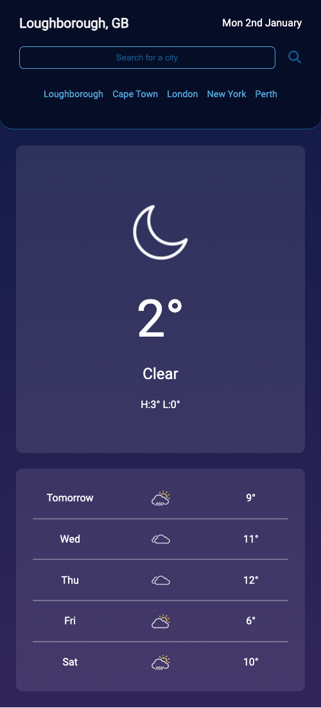

[![MIT License][license-shield]][license-url]
[![LinkedIn][linkedin-shield]][linkedin-url]

<!-- PROJECT LOGO -->
 

  

<h3 align="center">Weather Dashboard</h3>

  

  Stay ahead of the weather with this simple weather app. With just a few taps, you can easily access detailed forecasts for cities around the world, giving you the confidence to plan your day with ease.

This app utilizes the reliable OpenWeatherMap API to provide in-depth forecasts for the current day and the next five days. This includes high and low temperatures, humidity levels, and wind speed, helping you stay informed and prepared for whatever Mother Nature has in store.

 
<a href="https://github.com/mdyeates/weather-app"><strong>Explore the docs »</strong></a>
 
 
<a href="https://mdyeates.github.io/weather-app/">View Live Deployment</a>
·
<a href="https://github.com/mdyeates/weather-app/issues">Report Bug</a>
·
<a href="https://github.com/mdyeates/weather-app/issues">Request Feature</a>

  

<!-- TABLE OF CONTENTS -->

  
Table of Contents

  <ol>
    <li>
      <a href="#about-the-project">About The Project</a>
      <ul>
        <li><a href="#built-with">Built With</a></li>
      </ul>
    </li>
        <li><a href="#usage">Usage</a></li>
    <li><a href="#contributing">Contributing</a></li>
    <li><a href="#license">License</a></li>
    <li><a href="#contact">Contact</a></li>
    <li><a href="#acknowledgments">Acknowledgments</a></li>
  </ol>

<!-- ABOUT THE PROJECT -->

## About The Project

[![Weather][product-screenshot]](https://mdyeates.github.io/weather-app/)

User Story:

- AS A traveler
- I WANT to see the weather outlook for multiple cities
- SO THAT I can plan a trip accordingly

Project Summary:

This weather dashboard makes it easy to stay on top of the latest weather conditions for your favorite cities. Using the reliable OpenWeatherMap API, you can search for a city and quickly see a detailed overview of the current weather, including the city name, date, weather icon, temperature, humidity, and wind speed. You'll also have access to a 5-day forecast that includes the date, weather icon, temperature, and humidity.

And when you search for a city, this dashboard will automatically adjust the theme to reflect whether it's currently night or day in that location, so you can easily view the weather at a glance. Plus, any city you search for will be saved in your search history, so you can easily access the weather conditions for that city again in the future.

When the page first loads, the dashboard will also use the web browser's geolocation API to determine your current location and display the weather for that location.

While working on this project, I gained valuable experience in accessing and retrieving data from RESTful web APIs using AJAX calls. I also learned how to process the returned data and use it in conjunction with JavaScript logic to generate dynamic page elements, enabling an application to display customized content based on the responses from the API.

(<a href="#readme-top">back to top</a>)

### Built With

[![JQuery][jquery.com]][jquery-url]

(<a href="#readme-top">back to top</a>)

## Usage

The following animation demonstrates the application functionality:

This application is designed to adapt to various screen sizes, including those of mobile devices, and can be easily used on the go, e.g:

(<a href="#readme-top">back to top</a>)

<!-- CONTRIBUTING -->

## Contributing

Contributions are what make the open source community such an amazing place to learn, inspire, and create. Any contributions you make are **greatly appreciated**.

If you have a suggestion that would make this better, please fork the repo and create a pull request. You can also simply open an issue with the tag "enhancement".
Don't forget to give the project a star! Thanks again!

1. Fork the Project
2. Create your Feature Branch (`git checkout -b feature/AmazingFeature`)
3. Commit your Changes (`git commit -m 'Add some AmazingFeature'`)
4. Push to the Branch (`git push origin feature/AmazingFeature`)
5. Open a Pull Request

(<a href="#readme-top">back to top</a>)

<!-- LICENSE -->

## License

Distributed under the MIT License. See `LICENSE.md` for more information.

(<a href="#readme-top">back to top</a>)

<!-- CONTACT -->

## Contact

Michael Yeates - [@mdyeates](https://twitter.com/mdyeates) - michael-yeates@outlook.com

Project Link: [https://github.com/mdyeates/weather-app](https://github.com/mdyeates/weather-app)

(<a href="#readme-top">back to top</a>)

<!-- ACKNOWLEDGMENTS -->

## Acknowledgments

- [Open Weather Map API](https://openweathermap.org/api)
- [Moment.js Docs](https://momentjs.com/)
- [JQuery Docs](https://jquery.com/)
- [JQuery Cheat Sheet](https://htmlcheatsheet.com/jquery/)
- [Introduction to server-side APIs](https://www.codenewbie.org/blogs/an-intro-to-apis)

(<a href="#readme-top">back to top</a>)

<!-- MARKDOWN LINKS & IMAGES -->

[license-shield]: https://img.shields.io/github/license/mdyeates/weather-app.svg?style=for-the-badge
[license-url]: https://github.com/mdyeates/weather-app/blob/main/LICENSE
[linkedin-shield]: https://img.shields.io/badge/-LinkedIn-black.svg?style=for-the-badge&logo=linkedin&colorB=555
[linkedin-url]: https://linkedin.com/in/mdyeates
[product-screenshot]: assets/images/screenshot.png
[jquery.com]: https://img.shields.io/badge/jQuery-0769AD?style=for-the-badge&logo=jquery&logoColor=white
[jquery-url]: https://jquery.com
